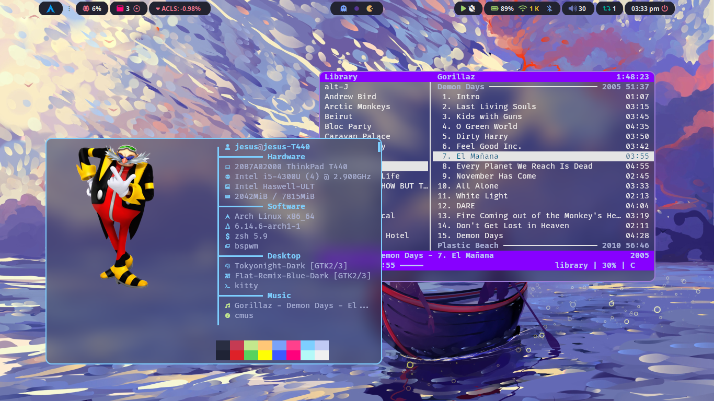

# My dotfiles

## Description

Dotfiles for my Linux setup, using Arch, BSPWM and polybar among other things.
Meant for my personal use, but feel free to take what you want, most's not mine
either way.

 

https://github.com/user-attachments/assets/df917a28-cdeb-4751-a0b0-b37b7fd342cd

## Things done

- Modules for polybar:
    - Stock tracker
    - Music
    - Bluetooth
    - Updates
    - Windows
    - The rest are totally gh0stzk's
- Battery notifications
- Cmus notifications
- Nvim configuration
- Screen recording (not a lot of capabilities yet)
- Keybinds (mostly)

## Todo list

- Autofirma
- KeePassXC
- Ranger
- Typst
- Latex (tectonic?)

## Credits

I have taken inspiration and code from many projects, too many to remember, but special mention to:
- [gh0stzk dotfiles](https://github.com/gh0stzk/dotfiles). Took emilia's rice as a base for many things
- [FlatRemix Icons](https://github.com/daniruiz/flat-remix), [BreezeX mouse](https://www.pling.com/p/1538515/), [TokyoNight theme](https://gist.github.com/CondensedMilk7/d1f10cd18e4583168c720d378b619d19)
- [w8ste's Rofi theme](https://github.com/w8ste/Tokyonight-rofi-theme)
- [sdhand's picom](https://github.com/sdhand/picom)
- [jbirnick's polybar timer](https://github.com/jbirnick/polybar-timer)
- [ttys3's kitty config](https://github.com/ttys3/my-kitty-config)
