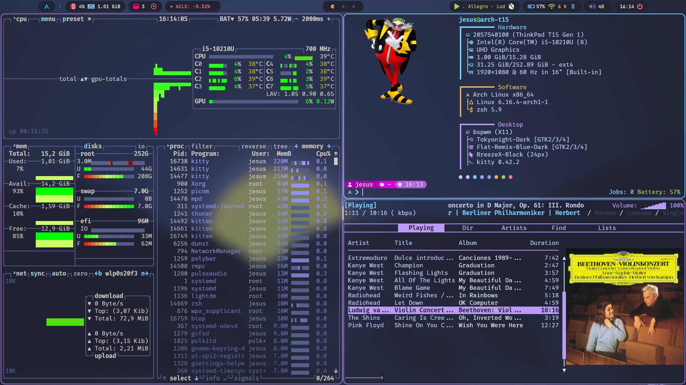

# My dotfiles

## Description

Dotfiles for my Linux setup, using Arch, BSPWM and polybar among other things.
Meant for my personal use, but feel free to take what you want.

 

https://github.com/user-attachments/assets/34e2275c-c201-47fc-9f09-97fde775025f

## Included

- Battery notifications
- Cmus and RMPC notifications
- Modules for polybar:
    - Stock tracker
    - Music
    - Bluetooth
    - Updates
    - Windows
    - The rest are totally gh0stzk's
- Nvim configuration
- Rofi menus:
    - Power menu
    - Screenshot menu
    - Windows menu
    - Notes menu
    - Quick Calculator
- Screen recording with ffmpeg
- Neofetch and Fastfetch configs
- Zshrc and cool prompt

## Credits

I have taken inspiration and code from many projects, too many to remember, but special mention to:
- [gh0stzk dotfiles](https://github.com/gh0stzk/dotfiles). Took emilia's rice as a base for many things
- [FlatRemix Icons](https://github.com/daniruiz/flat-remix), [BreezeX mouse](https://www.pling.com/p/1538515/), [TokyoNight theme](https://gist.github.com/CondensedMilk7/d1f10cd18e4583168c720d378b619d19)
- [w8ste's Rofi theme](https://github.com/w8ste/Tokyonight-rofi-theme)
- [sdhand's picom](https://github.com/sdhand/picom)
- [jbirnick's polybar timer](https://github.com/jbirnick/polybar-timer)
- [ttys3's kitty config](https://github.com/ttys3/my-kitty-config)
