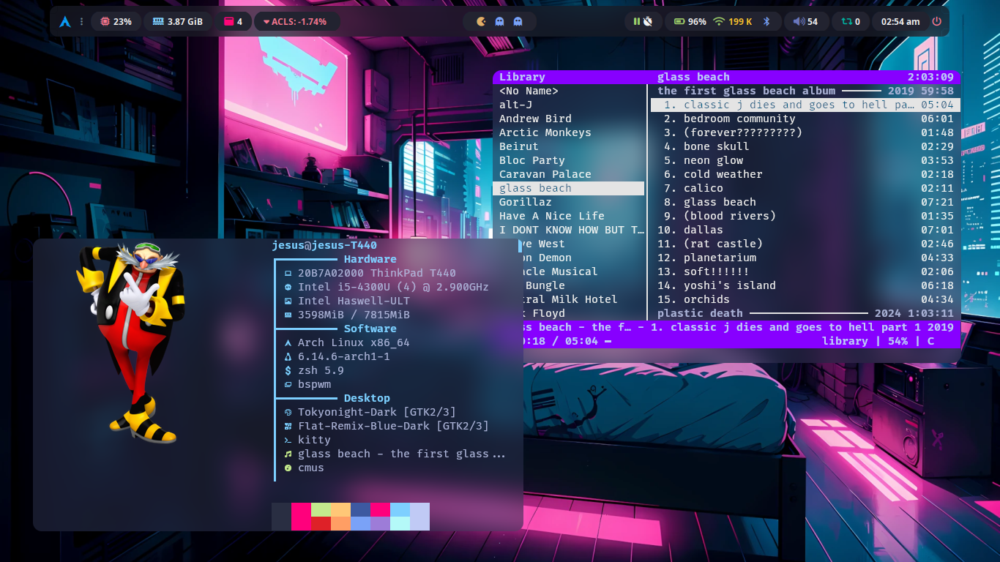

# My dotfiles

## Description

Dotfiles for my Linux setup, using Arch, BSPWM and polybar among other things.
Meant for my personal use, but feel free to take what you want, most's not mine
either way.

 

## Todo list

- Autofirma
- KeePassXC
- Ranger
- Typst
- Latex (tectonic?)
- Screen record

## Credits

I have taken inspiration and code from many projects, too many to remember, but special mention to:
- [gh0stzk dotfiles. Took emma's rice polybar and dunst as a base](https://github.com/gh0stzk/dotfiles)  
- [w8ste's Rofi theme](https://github.com/w8ste/Tokyonight-rofi-theme)
- [sdhand's picom](https://github.com/sdhand/picom)
- [jbirnick's polybar timer](https://github.com/jbirnick/polybar-timer)
